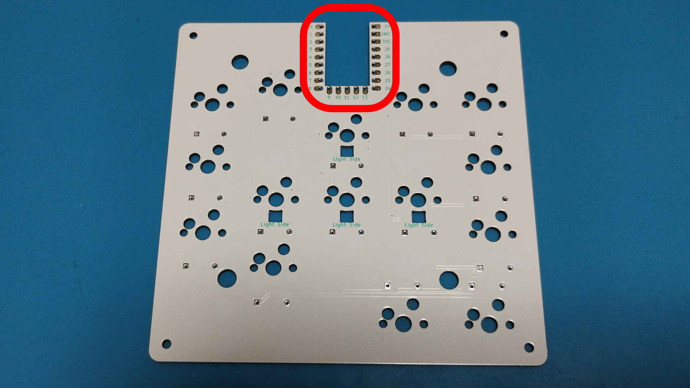
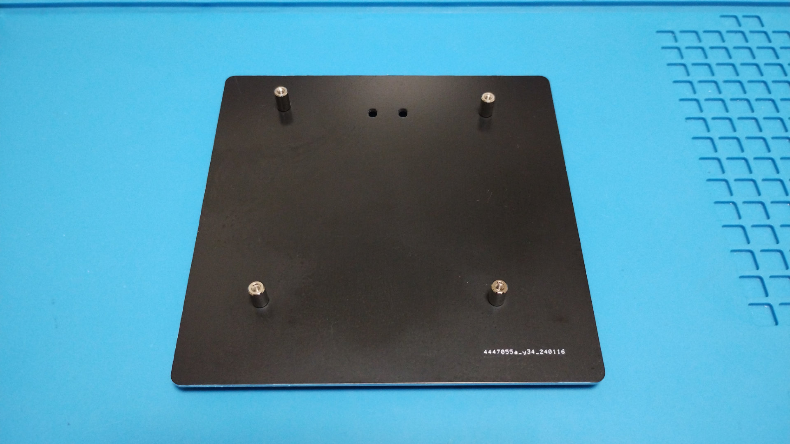
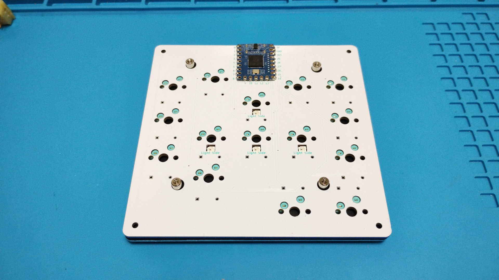
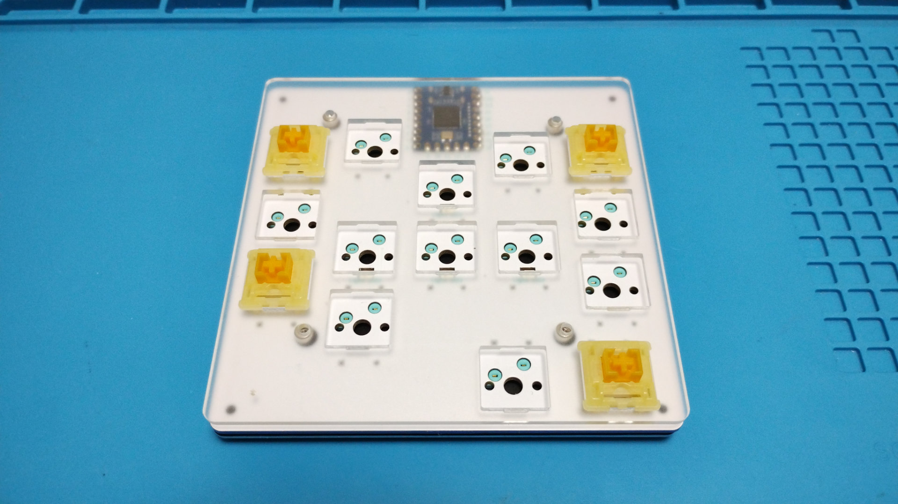
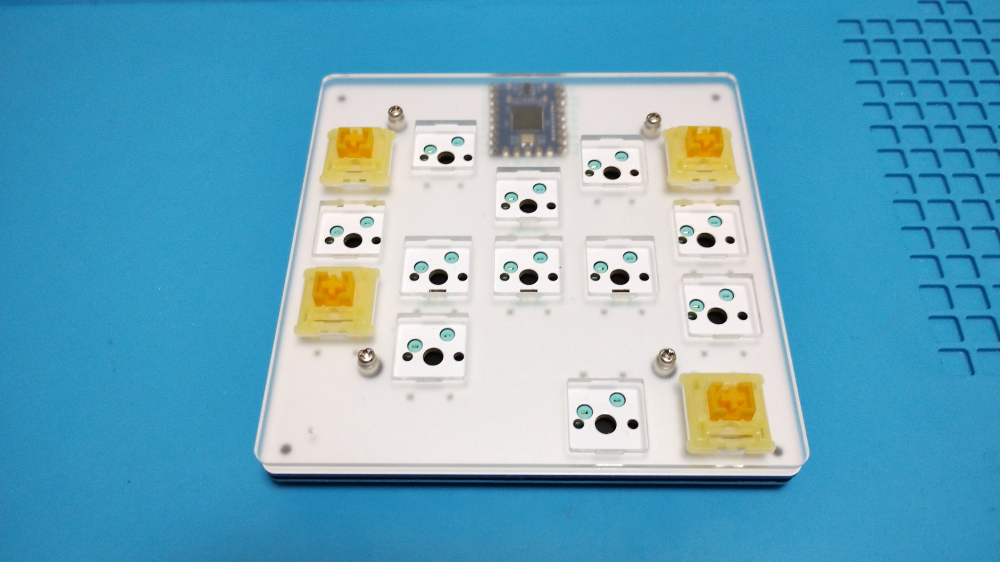
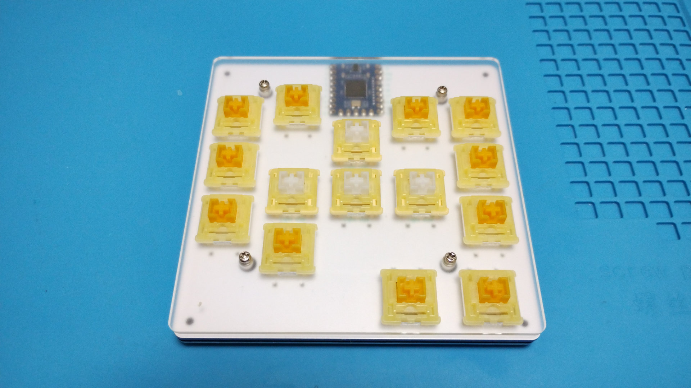
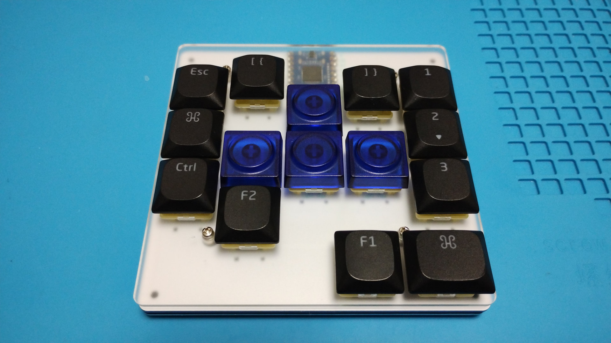

# Build guide

## Parts
Name                     |Quantity |Notes
-------------------------|---------|-----
PCB                      |1        |[Here's the data](https://github.com/is-watering/isw_geode/tree/main/hardware/pcb)
Switch plate             |1        |[Here's the data](https://github.com/is-watering/isw_geode/tree/main/hardware/plate)
Bottom plate             |1        |[Here's the data](https://github.com/is-watering/isw_geode/tree/main/hardware/plate)
SK6812 MINI-E leds       |4        |
1N4148W diodes           |15       |
Kailh hotswap sockets    |15       |
RP2040-Zero              |1        |
M2x4mm screws            |8        |
M2x7mm spacers           |4        |[HIROSUGI NET](https://www.hirosugi-net.co.jp/shop/c/c10141012/)

## Build PCB

### [Leds](https://github.com/is-watering/isw-kbd-building-tips/blob/main/doc/soldering-sk6812mini-e.md)

### [Diodes](https://github.com/is-watering/isw-kbd-building-tips/blob/main/doc/soldering-1n4148w.md)

### [Hotswap sockets](https://github.com/is-watering/isw-kbd-building-tips/blob/main/doc/soldering-cpg151101s11.md)

### RP2040-Zero
It is recommended to check whether the firmware can be written to the microcontroller in advance.
* [Remap](https://remap-keys.app/catalog/uf4aIRy3BQslvcxSSvND)
* [Soure code](https://github.com/is-watering/isw_geode/tree/main/firmware)

Solder the microcontroller from the top of the PCB, face down, using surface mount soldering.  
[Learn more about how to solder microcontrollers](https://github.com/is-watering/isw-kbd-building-tips/blob/main/doc/surfacemount-rp2040-zero.md)

## Build Case
Use a 4mm screw to secure the 7mm spacer.  

Place the PCB on the bottom plate.  

Place switch plate on the PCB. It is easier to align the key switches if they are attached to the four corners.  

Use a 4mm screw to secure the switch plate.Fix the switch plate using a 4mm screw.  

Attach a key switch of your choice.  

Attach a keycap of your choice to complete the process!  

Congratulations on the completion!  
Please be proud of it on social networking sites!  
`#isw_geode`