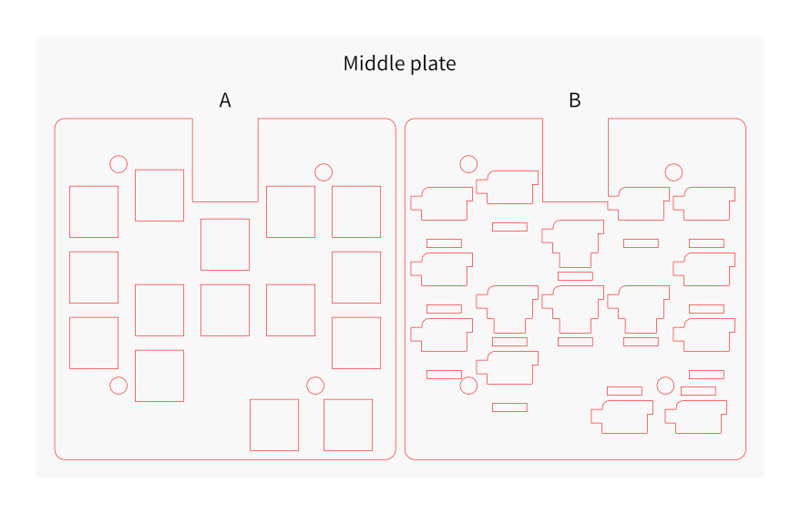

## Recommended format
Name                        |Material |Thickness      |Notes
----------------------------|---------|---------------|-----
Switch plate                |-        |1.6mm or 2.0mm |
Bottom plate                |-        |1.2mm - 2.0mm  |
Middle plate A              |Acrylic  |3.0mm          |
Middle plate B              |Acrylic  |2.0mm          |

## Notes
* Acrylic plates may have gaps between plates due to tolerances. In that case, please adjust by inserting foam (EVA, silicone, etc.) between the two.

